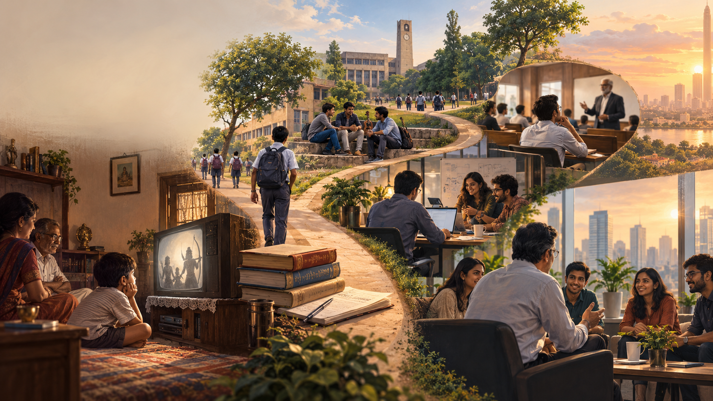

Every Teachers' Day, we remember the people who stood before us in classrooms, introduced us to new subjects and helped build the foundations of our lives.

This year, I find myself thinking about the word *teacher* more broadly.

Some teachers explained lessons from textbooks. Others entered my life as family members, friends, colleagues, managers, customers and team members. Some came in the form of books and scriptures. A few arrived disguised as failures, difficult decisions and uncertain situations.

Looking back at my journey, from childhood and engineering college to corporate life, IIM Calcutta and now the responsibility of building VirtuNx, I realise that the classrooms kept changing. So did my teachers.

## My First Classroom Was Home

My earliest teachers were not standing before a blackboard. They were at home.

My mother and sister played an important role in shaping the person I became. Much of what we learn from family is never formally presented as a lesson. We learn by observing how people respond to difficulty, care for others, make sacrifices and remain beside us as we find our way.

At different stages of life, their presence gave me strength, perspective and the confidence to continue moving forward. Those lessons became part of me long before I understood their importance.

Some of my earliest teachers also appeared through stories.

Like many children of my generation, I remember watching the *Ramayan* and *Mahabharat* on Doordarshan. At that age, I was captivated by the characters, emotions and dramatic events. They were stories that brought families together around a television.

As I grew older, reading and reflecting on the *Ramayan* and *Bhagavad Gita* allowed me to see those stories differently. Beneath the events were enduring questions about duty, relationships, ambition, loyalty, difficult choices and the responsibilities that come with leadership.

The stories had remained the same. What had changed was my ability to understand them.

Life gives new meaning to old lessons.

## From School to Engineering College

My schoolteachers gave me the academic foundations on which much of my later journey was built. But their contribution extended beyond subjects and examinations.

They taught me discipline, curiosity and the confidence to ask questions. Some encouraged me when I performed well. Others corrected me when I needed direction. Many of their lessons remained with me long after I had forgotten what was written in the textbooks.

Engineering college became a very different classroom.

It was not only about becoming an engineer. It was a period of discovering independence, forming opinions, solving problems and learning how to find my own direction.

The friends I made during those years also became my teachers. We learnt through shared ambitions, disagreements, mistakes and long conversations about what we wanted to do with our lives. Friends often show us aspects of ourselves that formal education cannot. They challenge our thinking, stand beside us during failures and help us grow without describing it as teaching.

## When Work Became the Classroom

I began my professional journey as a fresh graduate in a startup.

It was the first time I entered a world where the problems were real, the resources were limited and the answers were not available at the back of a textbook. Learning happened by doing. We experimented, made mistakes, corrected ourselves and tried again.

That experience taught me initiative and adaptability. It also taught me that knowledge alone is rarely sufficient. Progress requires the willingness to take responsibility, work with others and continue despite incomplete information.

As my career progressed through organisations such as Microsoft, Amazon and Salesforce, each environment introduced me to a new way of thinking.

Different managers demonstrated different forms of leadership. Colleagues showed me the value of collaboration. Customers helped me understand the distance that can exist between what we build and what people genuinely need.

Some projects taught me the discipline of execution. Others showed me how quickly assumptions can fail when confronted with reality. Success strengthened my confidence, while setbacks made me reconsider my approach.

Corporate life taught me that learning is not always comfortable. Sometimes the most important teacher is an assignment we did not expect, a decision that did not produce the intended result, or a conversation that challenged how we saw ourselves.

## Returning to School

After gaining professional experience, I returned to formal education at IIM Calcutta.

Going back to school after working was a humbling experience. I brought practical knowledge into the classroom, but the classroom also exposed the limitations of relying only on experience.

I was encouraged to examine problems through new frameworks, challenge assumptions and connect execution with broader business thinking. More importantly, I was reminded that experience should deepen our curiosity, not convince us that we already know enough.

We often think education prepares us for professional life. My experience was also the reverse: professional life prepared me to appreciate education differently.

## Learning to Lead

As I moved into product, management and leadership roles, the direction of learning changed again.

Earlier in my career, I primarily looked towards senior colleagues and managers for guidance. As a leader, I began to realise that learning does not follow an organisational hierarchy.

I learnt from peers who brought different experiences. I learnt from customers who described problems that our internal conversations had missed. I learnt from team members who asked questions for which I did not have immediate answers.

Most importantly, I learnt from younger professionals whose energy, curiosity and willingness to experiment challenged established ways of working.

Leadership, I discovered, is not about becoming the person with all the answers. It is about creating clarity when the answer is not obvious, asking better questions, making responsible decisions and enabling people to do their best work.

## The Journey Comes Full Circle

Today, as CEO of VirtuNx, I find myself in another classroom.

Building an organisation tests far more than professional knowledge. It tests judgment, patience, resilience and values. It requires balancing ambition with discipline, speed with sustainability and technology with human judgment.

I began my career as a young graduate trying to understand how an organisation worked. Today, I work with young professionals while taking responsibility for building an organisation of our own.

There is something deeply meaningful about that full circle.

The questions I once asked are now being asked of me. The opportunities that others once gave me are now opportunities I can create for someone else. The guidance I received from teachers, mentors, managers and colleagues now influences how I try to support the people around me.

Yet becoming a CEO has not represented the completion of my learning. It has shown me how much more there is to learn.

Every new customer conversation teaches me something. Every organisational challenge reveals a gap in my thinking. Every young professional who approaches a problem differently reminds me that leadership must remain curious.

## Remaining a Student

Looking back, I realise that time and circumstances have been among my greatest teachers.

Success taught me gratitude.

Failure taught me humility.

Responsibility taught me accountability.

Uncertainty taught me courage.

Relationships taught me empathy.

And every new beginning taught me that we are never truly finished students.

On this Teachers' Day, I express my heartfelt gratitude to everyone who has shaped my journey, my mother, my sister, my schoolteachers, professors, friends, mentors, managers, colleagues, customers and team members.

I am equally grateful for the books and scriptures that helped me reflect, the opportunities that allowed me to grow, and the difficult circumstances that taught me lessons I might never have chosen for myself.

Not every teacher enters our life carrying a textbook. Some offer encouragement. Some ask difficult questions. Some challenge our assumptions. Some teach through their actions. Others simply appear at the right moment and enable us to take the next step.

The classrooms keep changing. The teachers take different forms. And life keeps reminding us to remain students.

To every person and experience that has taught, guided, challenged or enabled me to grow, thank you.

**Happy Teachers' Day.**
